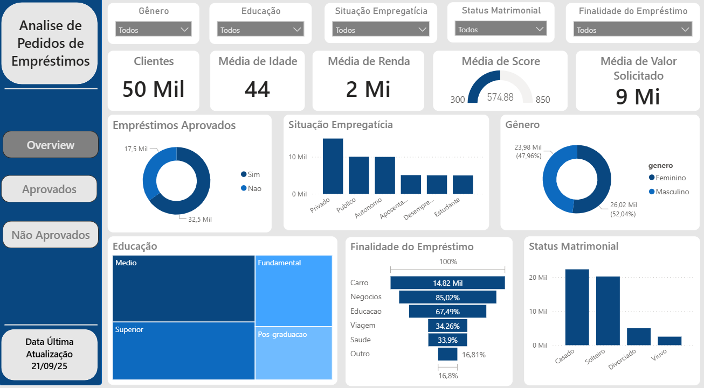

# Analise de Pedidos de Empréstimos

## Propósito do Dashboard

Projeto foi criado com o propósito de auxiliar nos estudos, teóricos e práticos, sobre analise de dados e também de metricas e negócios.

## Tecnologias Utilizadas

As tecnologias usadas nesse projeto incluem:

- ChatGPT: foi utilizado a ferramenta para criação do dataset usado
- Power Query: para fazer as transformações necessárias nos dados
- PowerBI: para criação do dashboard

## Origem dos Dados

Os dados foram criados por meio da ferramenta SimulaDados, uma ferramenta que gera datasets com dados ficticios para analise de dados.

## Dicionário de Dados

Nome da Coluna: id_cliente
Descrição: variavel unica para identificar a solicitação de um emprestimo
Tipo de Dados: número inteiro

Nome da Coluna: genero
Descrição: variavel para identificar o genero do solicitante
Tipo de Dados: texto
Valores Possíveis: Masculino / Feminino

Nome da Coluna: idade
Descrição: variavel que identifica a idade do solicitante
Tipo de Dados: número inteiro
Valores Possíveis: valores foram distribuidos desigualmente entre valores de 18 a 70

Nome da Coluna: possui_carro
Descrição: variavel para identificar se o solicitante possui algum veiculo
Tipo de Dados: texto
Valores Possíveis: Sim/Não

Nome da Coluna: possui_propriedade
Descrição: variavel para identificar se o solicitante possui alguma propriedade
Tipo de Dados: texto
Valores Possíveis: Sim/Não

Nome da Coluna: numero_filhos
Descrição: variavel para identificar se o solicitante possui filhos
Tipo de Dados: número inteiro
Valores Possíveis: valores foram distribuidos desigualmente entre valores de 0 e 5

Nome da Coluna: salario_anual
Descrição: variavel que representa o salário anual do solicitante
Tipo de Dados: número inteiro
Valores Possíveis: valores aleatorios, distribuidos desigualmete

Nome da Coluna: educacao
Descrição: variavel que representa o nível educacional do solicitante
Tipo de Dados: texto
Valores Possíveis: Fundamental / Medio / Superior / Pos-graduacao

Nome da Coluna: categoria_trabalho
Descrição: variavel que representa o tipo de trabalho do solicitante
Tipo de Dados: texto
Valores Possíveis: Privado / Publico / Autonomo / Aposentado

Nome da Coluna: status_matrimonial
Descrição: variavel que representa o status matrimonial do representante
Tipo de Dados: texto
Valores Possíveis: Solteiro / Casado / Divorviado / Viuvo

Nome da Coluna: pontuacao_credito
Descrição: variavel para represtar o score do solicitante
Tipo de Dados: número inteiro
Valores Possíveis: valores foram distribuidos aleatoriamente e desigualmente entre 300 e 850

Nome da Coluna: pagamentos_atrasados
Descrição: variavel que representa se o solicitante possui pagamentos atrasados de emprestimos 
Tipo de Dados: número inteiro

Nome da Coluna: valor_solicitado
Descrição: variavel que representa o valor do emprestimo que foi solicitado
Tipo de Dados: número inteiro
Valores Possíveis:  valores foram distribuidos aleatoriamente e desigualmente entre 5.000 a 200.000

Nome da Coluna: finalidade_emprestimo
Descrição: variavel para representar a finalidade do emprestimo
Tipo de Dados: texto
Valores Possíveis: Carro / Educacao / Negocios / Viagem / Saude / Outro

Nome da Coluna: qtd_emprestimos_anteriores
Descrição: variavel que identifica se já houve um emprestimo anterior
Tipo de Dados: número inteiro

Nome da Coluna: emprestimo_aprovado
Descrição: variavel que representa a aprovação do emprestimo
Tipo de Dados: texto
Valores Possíveis: Sim / Não

## 📫 KPIs (Key Performance Indicators) e Métricas

- aprovados = quantidade de emprestimos aprovados
- idade_aprovados = média da idade dos clientes com emprestimo aprovado
- idade_nao_aprovados = média da idade dos clientes com emprestimo recusado
- max_score = valor máximo da coluna pontuacao_credito 
- media_salario_aprovados = média salarial dos clientes com emprestimo aprovado
- media_salario_nao_aprovados = média salarial dos clientes com emprestimo recusado
- min_score = valor minimo da coluna pontuacao_credito 
- nao_aprovados = quantidade de emprestimos recusados
- qtd_emprestimos_aprovados = média da quantidade de emprestimos anteriores dos clientes com emprestimos aprovados
- qtd_emprestimos_nao_aprovados = média da quantidade de emprestimos anteriores dos clientes com emprestimos recusados
- score_aprovados = média da coluna pontuacao_credito dos clientes com emprestimos aprovados
- score_nao_aprovados = média da coluna pontuacao_credito dos clientes com emprestimos recusados
- valor_solicitado_aprovados = média do valor solicitado por clientes que tiveram o emprestimo aprovado
- valor solicitado_nao_aprovados = média do valor solicitado por clientes que tiveram o emprestimo recusado

## Design e Layout do Dashboard

Estrutura do Dashboard: 

- Aba 1 - Overview: Gráficos com KPIs principais.
- Aba 2 - Emprestimos Aprovados: Foco nas caracteristicas dos clientes que tiveram o emprestimo aprovado.
- Aba 3 - Emprestimos Não Aprovados: Foco nas caracteristicas dos clientes que tiveram o emprestimo reprovado.

## Funcionalidades Principais

Na aba Overview é possível verificar os gráficos com as principais relações para a analise de emprestimos.

Nela é possível verificar os emprestimos aprovados, situação empregaticia, genero, educação, finalidade do emprestimo e status matrimonial seguindos um dos seguintes filtros:
- genero
- educação
- situação empregaticia
- status matrimonial
- finalidade do emprestimo

Todas as abas possuem botões para navegação simplificada entre as abas.
