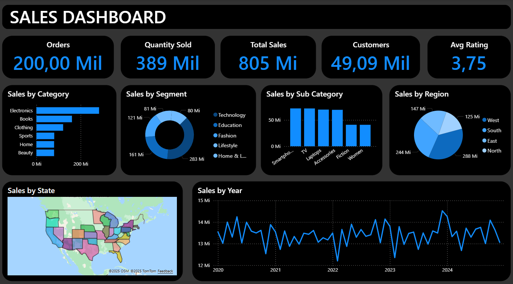

# Sales Dashboard

## Propósito do Dashboard

Projeto foi criado com o propósito de auxiliar nos estudos, teóricos e práticos, sobre analise de dados e também no estudo de metricas, KPI e negócios.

## Tecnologias Utilizadas

As tecnologias usadas nesse projeto incluem:

- ChatGPT: foi utilizado a ferramenta para criação do dataset
- Power Query: para fazer as transformações necessárias nos dados
- PowerBI: para criação do dashboard

## Origem dos Dados

Os dados foram criados por meio da ferramenta SimulaDados, uma ferramenta que gera datasets com dados ficticios para analise de dados.

## Dicionário de Dados

Nome da Coluna: Order_id
Descrição: variavel unica para identificar a solicitação de um emprestimo
Tipo de Dados: número inteiro

Nome da Coluna: Order_date
Descrição: variavel para identificar a data do pedido
Tipo de Dados: data
Valores Possíveis: datas entre 01/01/2020 e 31/12/2024

Nome da Coluna: Product
Descrição: variavel que identifica o nome do produto
Tipo de Dados: texto
Valores Possíveis: 

Nome da Coluna: Category
Descrição: variavel para identificar a categoria do produto
Tipo de Dados: texto
Valores Possíveis: Electronics, Books, Clothing, Home, Beauty and Sports

Nome da Coluna: Sub_Category
Descrição: variavel para identificar a sub categoria do produto
Tipo de Dados: texto
Valores Possíveis: Electronics: ["Smartphones", "Laptops", "Accessories", "TV"],
"Books": ["Fiction", "Non-fiction", "Comics", "Education"],
"Clothing": ["Men", "Women", "Kids"],
"Home": ["Furniture", "Kitchen", "Decor"],
"Beauty": ["Skincare", "Makeup", "Fragrance"],
"Sports": ["Fitness", "Outdoor", "Team Sports"]

Nome da Coluna: Segment
Descrição: variavel para identificar o segmento do produto
Tipo de Dados: texto
Valores Possíveis: Technology, Education, Fashion, Home & Living, Personal Care and Lifestyle

Nome da Coluna: Price
Descrição: variavel que representa o valor do item
Tipo de Dados: número inteiro
Valores Possíveis: valores aleatorios, distribuidos desigualmete

Nome da Coluna: Quantity
Descrição: variavel que representa a quantidade de itens comprados
Tipo de Dados: número inteiro
Valores Possíveis: 1, 2, 3, 4, 5 e 10

Nome da Coluna: Purchase_Type
Descrição: variavel que representa o tipo de compra efetuada
Tipo de Dados: texto
Valores Possíveis: Online, App, Drive-Thru and Store

Nome da Coluna: Payment_Method
Descrição: variavel que representa o metodo do pagamento do pedido
Tipo de Dados: texto
Valores Possíveis: Credit Card, Debit Card, PayPal, Gift Card and Money

Nome da Coluna: Shipping_date
Descrição: variavel para represta a data de envio do pedido
Tipo de Dados: date
Valores Possíveis: valores de 1 a 3 adicionados ao valor da coluna Order_date

Nome da Coluna: Delivery_date
Descrição: variavel que representa a data de entrega do pedido
Tipo de Dados: date
Valores Possíveis: valores de 3 a 7 adicionados ao valor da coluna Order_date

Nome da Coluna: Customer_id
Descrição: variavel que identifica o id do cliente que efetuou o pedido, cada cliente recebendo uma única id
Tipo de Dados: número inteiro

Nome da Coluna: Customer_gender
Descrição: variavel que identifica o genero do cliente que efetuou o pedido
Tipo de Dados: texto
Valores Possíveis: Feminino e Masculino

Nome da Coluna: Customer_age
Descrição: variavel que identifica a idade do cliente que efetuou o pedido
Tipo de Dados: número inteiro
Valores Possíveis: valores desigualmente distribuidos entre 18 e 80

Nome da Coluna: Customer_city
Descrição: variavel que identifica a cidade do cliente que efetuou o pedido
Tipo de Dados: texto

Nome da Coluna: Customer_state
Descrição: variavel que identifica o estado do cliente que efetuou o pedido
Tipo de Dados: texto
Valores Possíveis: qualquer estado dos USA

Nome da Coluna: Region
Descrição: variavel que identifica a região do cliente que efetuou o pedido
Tipo de Dados: texto
Valores Possíveis: North, South, East and West

Nome da Coluna: Rating
Descrição: variavel que representa nota do produto
Tipo de Dados: número inteiro
Valores Possíveis: 1, 2, 3, 4 e 5

## 📫 KPIs (Key Performance Indicators) e Métricas
- Sales: coluna criada pela multiplicação entre produtos vendidos (quantity) e seus valores (price)

## Design e Layout do Dashboard

Estrutura do Dashboard: 

- Orders - quantidade de pedidos
- Quantity Sold - quantidade de produtos vendidos
- Total Sales - valor da soma das vendas
- Customers - quantidade de clientes
- Avg Ratings - média da avalização dos produtos
- Sales by Category - gráfico de barras horizontais representando o total de vendas por categoria
- Sales by Segment - gráfico de rosca representando o total de vendas por segmento
- Sales by Sub Category: grafico de barras representando o total de vendas por sub categoria
- Sales by Region - grafico de pizza representando o total de vendas por região
- Sales by State - mapa representando o total de vendas por estado
- Sales by Year - grafico de linhas representado o total de vendas por ano

## Funcionalidades Principais

Na aba Overview é possível verificar os gráficos com as principais relações para a analise de vendas da empresa.

Nela é possível verificar os emprestimos aprovados, situação empregaticia, genero, educação, finalidade do emprestimo e status matrimonial seguindos o filtro de ano.

